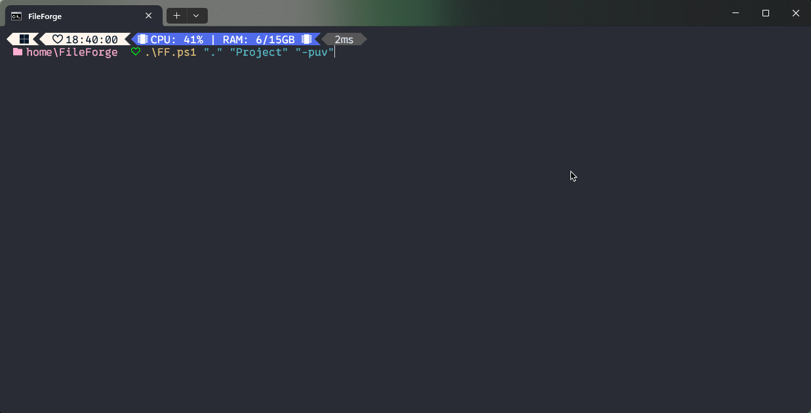
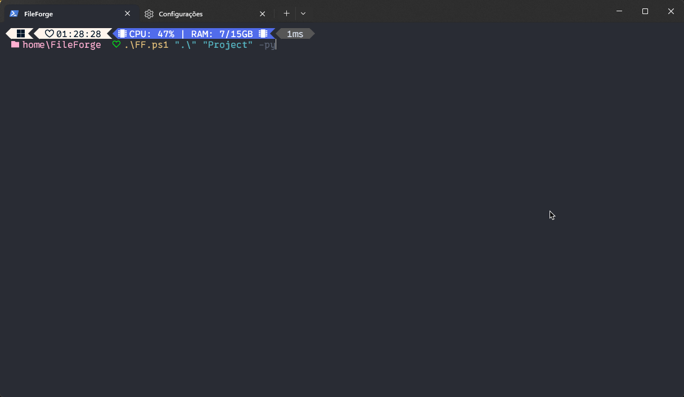
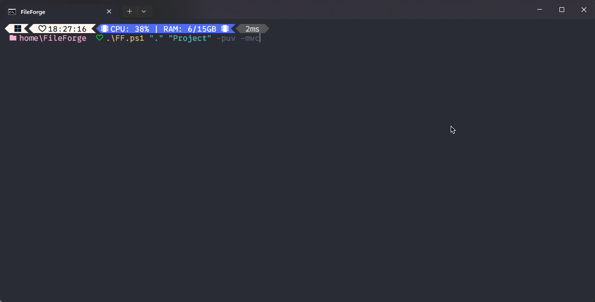
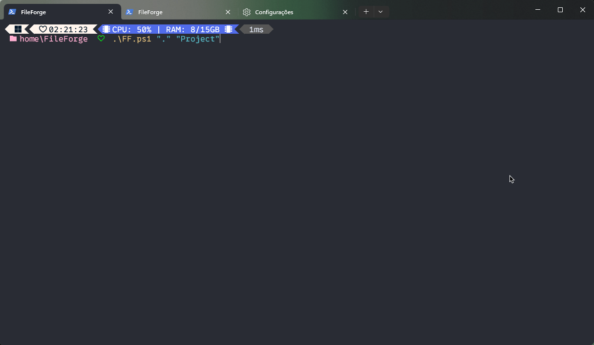
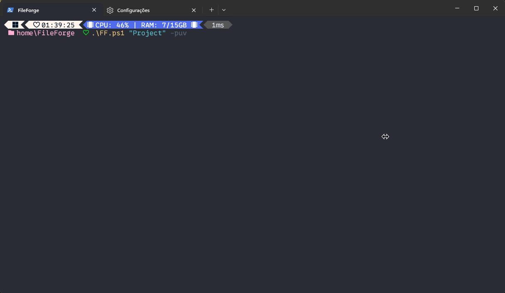

# 

O FileForge é uma ferramenta de linha de comando projetada para simplificar e agilizar o processo de criação de estruturas de diretórios e arquivos para projetos de desenvolvimento de software. Com este programa, os desenvolvedores podem facilmente gerar estruturas de pastas e arquivos para uma variedade de tipos de projetos, incluindo aqueles que seguem padrões específicos, como arquitetura MVC (Model-View-Controller) ou projetos Python. Oferecendo suporte amplo e feedback visual claro, o FileForge é uma solução conveniente para configurar rapidamente a base de um projeto, permitindo que os desenvolvedores se concentrem mais no desenvolvimento de software e menos na organização inicial do projeto.

## Sumário

- [Instalação](#instalação)
- [Como Usar](#como-usar)
- [Tipos de estruturas](#tipos-de-estruturas)
- [Features](#features)
- [Troubleshooting](#troubleshooting)
- [Contribua e Reporte Problemas](#contribua-e-reporte-problemas)
- [Para mais informações](#para-mais-informações)

## Instalação

🚀

### 1. Faça o [download.zip](https://github.com/Gustavo2022003/FileForge/archive/refs/heads/FF-main.zip) ou clone este repositório para o seu computador.

**GitHub CLI:**

```
gh repo clone Gustavo2022003/FileForge
```

**HTTPS:**
```
git clone https://github.com/Gustavo2022003/FileForge.git
```

**SSH:**
```
git@github.com:Gustavo2022003/FileForge.git
```

### 2. Certifique-se de ter o PowerShell instalado no seu sistema:

Para verificar se o PowerShell está instalado no seu sistema Windows, você pode seguir estas etapas:

1. **Abrir o PowerShell**: Pressione as teclas `Win + R` para abrir a caixa de diálogo "Executar", digite "powershell" e pressione Enter. Se o PowerShell estiver instalado, uma janela do PowerShell será aberta.

2. **Verificar a versão**: No PowerShell, você pode digitar o seguinte comando e pressionar Enter:
   ```
   $PSVersionTable.PSVersion
   ```
   Isso exibirá informações sobre a versão do PowerShell instalada no seu sistema.

3. **Verificar a presença do executável**: Você também pode verificar se o executável do PowerShell está presente no seu sistema. O caminho padrão para o executável do PowerShell é `C:\Windows\System32\WindowsPowerShell\v1.0\powershell.exe`. Você pode navegar até este diretório no Explorador de Arquivos e verificar se o arquivo `powershell.exe` está presente.

Se o PowerShell estiver instalado, você poderá ver sua versão e iniciar o ambiente do PowerShell sem problemas. Se não estiver instalado, você pode instalar a versão mais recente diretamente do site da Microsoft ou através do Windows Store, dependendo da sua versão do Windows.

### 3. Navegue até o diretório onde você baixou/clonou o repositório.


### 4. Execute o script `FF.ps1` usando o PowerShell.

---

Para melhorar a seção "Como Usar", podemos adicionar mais detalhes sobre cada uma das opções disponíveis e fornecer exemplos de uso mais claros. Aqui está uma versão aprimorada:

## Como Usar

📝 Para utilizar o projeto, execute o script `FF.ps1` no PowerShell com os seguintes parâmetros:

```
.\FF.ps1 <diretório_de_destino> <nome_do_projeto> [-puv] [-mvc] [-py] [-help]
```

Você também pode especificar as opções como uma string delimitada por aspas:

```
.\FF.ps1 <diretório_de_destino> <nome_do_projeto> ["-puv"] ["-mvc"] ["-py"] ["-help"]
```



### Opções

⚙️ Aqui estão as opções disponíveis:

| Opção  | Descrição                                                                                                            |
|--------|----------------------------------------------------------------------------------------------------------------------|
| `-puv` | Cria a estrutura de diretórios e arquivos para um projeto com a estrutura de diretórios públicos, utils e views.     |
| `-mvc` | Cria a estrutura de diretórios e arquivos para um projeto seguindo o padrão de arquitetura MVC (Model-View-Controller). |
| `-py`  | Cria a estrutura de diretórios e arquivos para um projeto Python.                                                     |
| `-help`| Exibe a mensagem de ajuda com informações sobre como usar o script.                                                   |

Certifique-se de escolher a opção adequada para o tipo de projeto que você está iniciando. Por exemplo:

```
.\FF.ps1 C:\Projetos\MeuProjeto meu_projeto -mvc
```

Este comando criará a estrutura de diretórios e arquivos para um projeto MVC chamado "meu_projeto" no diretório "C:\Projetos\MeuProjeto".

## Tipos de estruturas

O FileForge oferece suporte a diferentes tipos de estruturas de diretórios e arquivos, incluindo:

- **PUV**: Estrutura com diretórios: public, utils e views.
- **MVC**: Estrutura seguindo o padrão de arquitetura MVC (Model-View-Controller).
- **Python**: Estrutura para projetos Python.

Claro, aqui está uma versão aprimorada da seção "Features":

## Features

✨ O FileForge oferece diversas funcionalidades que tornam a criação de estruturas de diretórios e arquivos mais eficiente e intuitiva:

- **Rápido e Fácil**: Facilita a criação rápida e fácil de estruturas de diretórios e arquivos para uma ampla variedade de tipos de projetos, reduzindo significativamente o tempo gasto na configuração inicial do projeto.

- **Suporte Amplo**: Oferece suporte abrangente para diversos tipos de projetos, incluindo aqueles com estrutura de diretórios públicos, utils e views, seguindo o padrão de arquitetura MVC (Model-View-Controller) e projetos Python, permitindo uma adaptação flexível às necessidades específicas de cada projeto.

- **Feedback Visual**: Fornece mensagens de feedback coloridas durante o processo de criação da estrutura, tornando mais fácil e rápido identificar o sucesso ou falha na criação, permitindo uma experiência mais intuitiva e informativa para o usuário.

Essas características combinadas tornam o FileForge uma ferramenta poderosa e conveniente para desenvolvedores, permitindo que eles se concentrem mais no desenvolvimento de software e menos na organização inicial do projeto.

## Troubleshooting

🛟 Se encontrar problemas ao usar o FileForge, verifique o seguinte:

- **PowerShell**: Certifique-se de ter o PowerShell instalado e configurado corretamente no seu sistema.
- **Permissões**: Verifique se você tem permissões suficientes para criar diretórios e arquivos no diretório de destino.
- **Issues**: Se encontrar erros específicos, consulte a seção de [Issues](https://github.com/Gustavo2022003/FileForge/issues) ou abra uma nova Issue para relatar o problema.

## Possíveis Erros e Soluções

Durante o uso do FileForge, você pode encontrar alguns erros comuns. Aqui estão alguns dos problemas mais frequentes e suas soluções correspondentes:

### 1. Erro de Permissão Negada ao Criar Diretório ou Arquivo

**⚠️ Problema**: Você recebe uma mensagem de erro indicando que não tem permissão para criar um diretório ou arquivo no diretório de destino.

**✅ Solução**: Verifique suas permissões de usuário no sistema operacional. Certifique-se de que você tenha permissões de escrita no diretório de destino. Se estiver

 executando o script em um ambiente controlado por políticas de segurança, entre em contato com o administrador do sistema para obter assistência.

### 2. Projeto com Nome Duplicado

**⚠️ Problema**: Você tenta criar um projeto com um nome que já existe no diretório de destino.

**✅ Solução**: Escolha um nome diferente para o projeto ou exclua o projeto existente antes de tentar criar um novo com o mesmo nome. Certifique-se de verificar o diretório de destino antes de criar um novo projeto para evitar conflitos de nome.




### 3. Erro ao Executar o Script

**⚠️ Problema**: Você recebe um erro ao tentar executar o script `FF.ps1`.

**✅ Solução**: Verifique se o PowerShell está instalado corretamente no seu sistema e se você está usando o comando correto para executar o script. Certifique-se também de estar no diretório correto onde o script está localizado. Se o problema persistir, verifique se há erros de sintaxe no script ou se há dependências ausentes.

### 4. Erro ao Mover Arquivos

**⚠️ Problema**: O script não consegue mover alguns arquivos para seus destinos finais.

**✅ Solução**: Verifique se os diretórios de destino estão corretamente criados e se o script tem permissão para acessá-los. Certifique-se de que os nomes dos arquivos e diretórios estejam corretos e que não haja conflitos de nome. Se necessário, verifique as permissões de escrita e acesso no sistema de arquivos.

### 5. Problemas de Configuração do Ambiente

**⚠️ Problema**: O script não funciona como esperado devido a configurações de ambiente incorretas.

**✅ Solução**: Certifique-se de que todas as configurações de ambiente necessárias estejam corretamente configuradas. Isso pode incluir variáveis de ambiente, configurações do PowerShell, permissões de usuário e outros fatores que podem afetar a execução do script. Consulte a documentação do FileForge e do PowerShell para obter mais informações sobre as configurações de ambiente necessárias.

### 6. Parâmetro duplicado (flag 🚩)

**⚠️ Problema**: Duplicação de parâmetro na hora da execução do script

**✅ Solução**: Certifique-se de selecionar apenas um dos parâmetros de opção. Você pode encontrar esses parâmetros na sessão: [Opções ⚙️](#opções)



### 7. Parâmetro inexistente (flag 🚩)

**⚠️ Problema**: Parâmetro inexistente no programa está sendo atribuído em algum argumento

**✅ Solução**: Certifique-se de selecionar apenas um dos parâmetros de opção. Você pode encontrar esses parâmetros na sessão: [Opções ⚙️](#opções)


### 8. Parâmetro não definido (flag 🚩)

**⚠️ Problema**: Nenhum parâmetro (flag 🚩) foi selecionado para a criação do projeto

**✅ Solução**: Certifique-se de selecionar apenas um dos parâmetros de opção. Você pode encontrar esses parâmetros na sessão: [Opções ⚙️](#opções)



### 9. Diretório alvo não definido

**⚠️ Problema**: Nenhum diretório foi atribuído ao segundo parâmetro

**✅ Solução**: Certifique-se de informar o nome do diretório que será criado o projeto: Você pode encontrar a estrutura do programa na sessão [Como Usar 📝](#como-usar)



### 10. Nome do projeto não definido

**⚠️ Problema**: O nome do projeto não foi atribuído ao terceiro parâmetro

**✅ Solução**: Certifique-se de informar o nome do projeto: Você pode encontrar a estrutura do programa na sessão [Como Usar 📝](#como-usar)


Se você encontrar outros erros ou problemas ao usar o FileForge, sinta-se à vontade para relatar o problema abrindo uma nova Issue no [repositório do projeto](https://github.com/Gustavo2022003/FileForge/issues). Estamos aqui para ajudar e resolver quaisquer problemas que você possa enfrentar durante o uso da ferramenta.

## Contribua e Reporte Problemas

🤝 Se tiver dúvidas, sugestões de melhorias ou encontrar bugs, sinta-se à vontade para abrir uma nova Issue no [repositório do projeto](https://github.com/Gustavo2022003/FileForge/issues). Estamos sempre abertos a feedback e contribuições ❤️

## Para mais informações

Visite o [repositório do projeto](https://github.com/Gustavo2022003/FileForge) para mais detalhes e atualizações.
