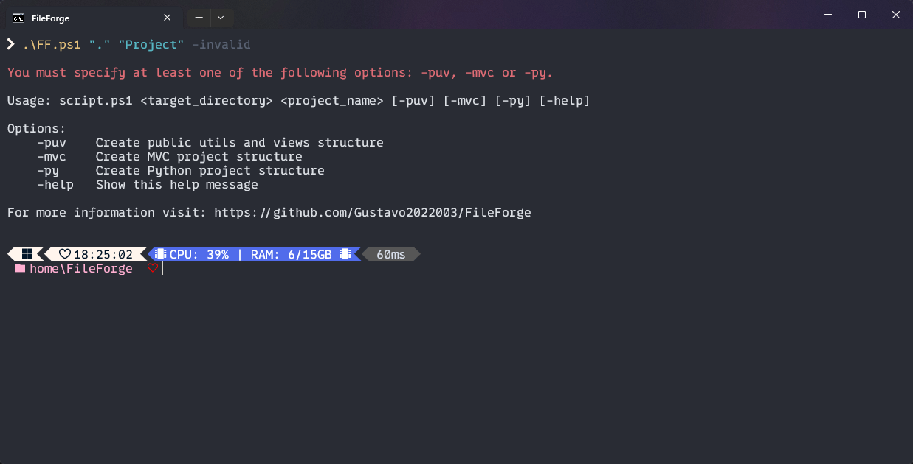

# 

FileForge is a command-line tool designed to simplify and streamline the process of creating directory and file structures for software development projects. With this program, developers can easily generate folder and file structures for a variety of project types, including those following specific standards such as MVC (Model-View-Controller) architecture or Python projects. Offering broad support and clear visual feedback, FileForge is a convenient solution for quickly setting up the foundation of a project, allowing developers to focus more on software development and less on the initial project organization.

## Summary

- [Installation](#installation)
- [How to Use](#how-to-use)
- [Types of Structures](#types-of-structures)
- [Features](#features)
- [Troubleshooting](#troubleshooting)
- [Contribute and Report Issues](#contribute-and-report-issues)
- [For More Information](#for-more-information)

## Installation

🚀

### 1. Download the [ZIP file](https://github.com/Gustavo2022003/FileForge/archive/refs/heads/FF-main.zip) or clone this repository to your computer.

**GitHub CLI:**

```
gh repo clone Gustavo2022003/FileForge
```

**HTTPS:**
```
git clone https://github.com/Gustavo2022003/FileForge.git
```

**SSH:**
```
git@github.com:Gustavo2022003/FileForge.git
```

### 2. Make sure you have PowerShell installed on your system:

To check if PowerShell is installed on your Windows system, you can follow these steps:

1. **Open PowerShell**: Press `Win + R` keys to open the "Run" dialog, type "powershell", and press Enter. If PowerShell is installed, a PowerShell window will open.

2. **Check the version**: In PowerShell, you can type the following command and press Enter:
   ```
   $PSVersionTable.PSVersion
   ```
   This will display information about the PowerShell version installed on your system.

3. **Check the presence of the executable**: You can also check if the PowerShell executable is present on your system. The default path for the PowerShell executable is `C:\Windows\System32\WindowsPowerShell\v1.0\powershell.exe`. You can navigate to this directory in File Explorer and check if the `powershell.exe` file is present.

If PowerShell is installed, you should be able to see its version and start the PowerShell environment without issues. If it's not installed, you can install the latest version directly from the Microsoft website or through the Windows Store, depending on your Windows version.

### 3. Navigate to the directory where you downloaded/cloned the repository.

### 4. Run the `FF.ps1` script using PowerShell.

---

To improve the "How to Use" section, we can add more details about each of the available options and provide clearer usage examples. Here's an enhanced version:

## How to Use

📝 To use the project, run the `FF.ps1` script in PowerShell with the following parameters:

```
.\FF.ps1 <destination_directory> <project_name> [-puv] [-mvc] [-py] [-jupyter] [-help]
```

You can also specify options as a string enclosed in quotes:

```
.\FF.ps1 <destination_directory> <project_name> ["-puv"] ["-mvc"] ["-py"] [-jupyter] ["-help"]
```


### Options

⚙️ Here are the available options:

| Option  | Description                                                                                                          |
|--------|----------------------------------------------------------------------------------------------------------------------|
| `-puv` | Creates the directory and file structure for a project with public, utils, and views directories.                   |
| `-mvc` | Creates the directory and file structure for a project following the MVC (Model-View-Controller) architecture pattern.|
| `-py`  | Creates the directory and file structure for a Python project.                                                        |
| `-jupyter`| Creates the directory and file structure for a Python project with JupyterLab.                                      |
| `-help`| Displays the help message with information on how to use the script.                                                   |

Make sure to choose the appropriate option for the type of project you're starting. For example:

```
.\FF.ps1 C:\Projects\MyProject my_project -mvc
```

This command will create the directory and file structure for an MVC project named "my_project" in the directory "C:\Projects\MyProject".

## Types of Structures

FileForge supports different types of directory and file structures, including:

- **PUV**: Structure with directories: public, utils, and views.
- **MVC**: Structure following the MVC (Model-View-Controller) architecture pattern.
- **Python**: Structure for Python projects.
- **Jupyter**: Structure for Python projects with Jupyter Lab.

upyterLab.

Of course, here's an enhanced version of the "Features" section:

## Features

✨ FileForge offers various functionalities that make creating directory and file structures more efficient and intuitive:

- **Fast and Easy**: Facilitates quick and easy creation of directory and file structures for a wide variety of project types, significantly reducing the time spent on initial project setup.

- **Broad Support**: Provides comprehensive support for various types of projects, including those with public, utils, and views directory structures, following the MVC (Model-View-Controller) architecture pattern, and Python projects, allowing flexible adaptation to the specific needs of each project.

- **Visual Feedback**: Provides colorful feedback messages during the structure creation process, making it easier and faster to identify success or failure in creation, enabling a more intuitive and informative experience for the user.

These combined features make FileForge a powerful and convenient tool for developers, allowing them to focus more on software development and less on the initial project organization.

## Troubleshooting

🛠️ If you encounter issues when using FileForge, check the following:

- **PowerShell**: Make sure you have PowerShell installed and configured correctly on your system.
- **Permissions**: Verify that you have sufficient permissions to create directories and files in the target directory.
- **Issues**: If you encounter specific errors, refer to the [Issues](https://github.com/Gustavo2022003/FileForge/issues) section or open a new Issue to report the problem.

## Possible Errors and Solutions

While using FileForge, you may encounter some common errors. Here are some of the most frequent issues and their corresponding solutions:

### 1. Permission Denied Error When Creating Directory or File

**⚠️ Problem**: You receive an error message indicating that you do not have permission to create a directory or file in the target directory.

**✅ Solution**: Check your user permissions on the operating system. Ensure you have write permissions in the target directory. If you're running the script in a security-controlled environment, contact the system administrator for assistance.

### 2. Duplicate Project Name

**⚠️ Problem**: You attempt to create a project with a name that already exists in the target directory.

**✅ Solution**: Choose a different name for the project or delete the existing project before attempting to create a new one with the same name. Make sure to check the target directory before creating a new project to avoid name conflicts.


### 3. Error When Running the Script

**⚠️ Problem**: You receive an error when trying to execute the `FF.ps1` script.

**✅ Solution**: Verify that PowerShell is installed correctly on your system and that you're using the correct command to run the script. Also, make sure you're in the correct directory where the script is located. If the issue persists, check for syntax errors in the script or missing dependencies.

### 4. Error When Moving Files

**⚠️ Problem**: The script fails to move some files to their final destinations.

**✅ Solution**: Check if the target directories are correctly created and if the script has permission to access them. Ensure that file and directory names are correct and that there are no naming conflicts. If necessary, check write and access permissions in the file system.

### 5. Environment Configuration Issues

**⚠️ Problem**: The script doesn't work as expected due to incorrect environment settings.

**✅ Solution**: Make sure all necessary environment settings are correctly configured. This may include environment variables, PowerShell settings, user permissions, and other factors that may affect script execution. Refer to the FileForge and PowerShell documentation for more information on required environment settings.

### 6. Duplicate Parameter (Flag 🚩)

**⚠️ Problem**: Duplicate parameter in script execution.

**✅ Solution**: Make sure to select only one of the option parameters. You can find these parameters in the [Options ⚙️](#options) section.


### 7. Nonexistent Parameter (Flag 🚩)

**⚠️ Problem**: Nonexistent parameter is being assigned in some argument.

**✅ Solution**: Make sure to select only one of the option parameters. You can find these parameters in the [Options ⚙️](#options) section.



### 8. Undefined Parameter (Flag 🚩)

**⚠️ Problem**: No parameter (flag 🚩) was selected for project creation.

**✅ Solution**: Make sure to select only one of the option parameters. You can find these parameters in the [Options ⚙️](#options) section.


### 9. Undefined Target Directory

**⚠️ Problem**: No directory was assigned to the first argument.

**✅ Solution**: Make sure to specify the directory name where the project will be created. You can find the program structure in the [How to Use 📝](#how-to-use) section.


### 10. Undefined Project Name

**⚠️ Problem**: The project name was not assigned to the second argument.

**✅ Solution**: Make sure to specify the project name. You can find the program structure in the [How to Use 📝](#how-to-use) section.


If you encounter other errors or issues when using FileForge, feel free to report the problem by opening a new Issue in the [project repository](https://github.com/Gustavo2022003/FileForge/issues). We're here to help and resolve any issues you may face while using the 
tool.

## Contribute and Report Issues

🤝 If you have questions, suggestions for improvements, or find bugs, feel free to open a new Issue in the [project repository](https://github.com/Gustavo2022003/FileForge/issues). We're always open to feedback and contributions ❤️

## For More Information

Visit the [project repository](https://github.com/Gustavo2022003/FileForge) for more details and updates.
